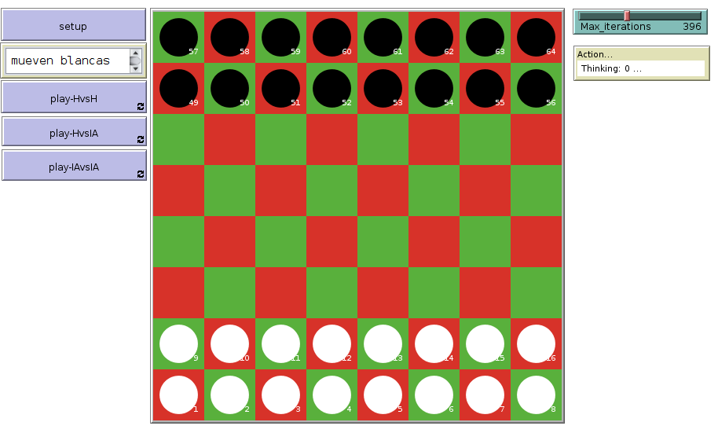
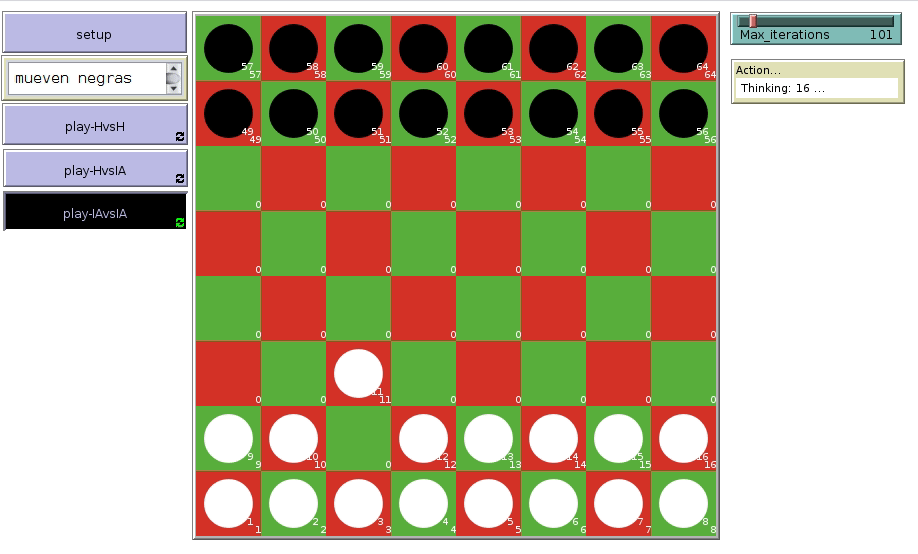

# Definición y funcionamiento de Breakthrough

Gran Avance es un abstracto juego de estrategia inventado por Dan Troyka en el año 2000. En el 2001 ganó la Competición de Diseño de Juegos 8x8 y tiene cierta similitud con las damas, pero la estrategia es completamente diferente. Se juega sobre un tablero de 8x8 casillas con fichas blancas y negras. El objetivo del juego consiste en alcanzar la fila principal del adversario - la más alejada respecto del jugador. Esto significa que el jugador blanco debe alcanzar la octava fila y que el negro debe alcanzar la primera fila para ganar la partida. Cada jugador mueve una ficha por turno. Una ficha puede ser movida una casilla hacia delante frontal o diagonalmente siempre y cuando la casilla de destino esté libre. Una ficha puede también ser movida a una casilla ocupada por otra del rival siempre y cuando esté una casilla delante diagonalmente. La partida finaliza si uno de los jugadores alcanza la fila principal del adversario.

# Como se usa

Para usarlo haz click en el boton HvsH en caso de que quieran jugar dos jugadors humanos o si prefieres jugar contra una inteligencia aritficial haz click en HvsIA. Trás esto haz click en setup.
Ahora solo tienes que hacer click en la ficha que quieras mover en caso de que el juego muestre tu turno y arrastrarla a la casilla donde se desee moverla.
Una vez finalizada la partida se mostrará un cartel donde se indique que jugador ha ganado, trás esto puedes volver a hacer click en setup para reinciar la partida y volver a jugar.

### Parametro

* **setup** : inicializa el entorno de juego.

* **Max_iterations** : indicamos cuanto de complejo será la IA. A mayor numero de iteraciones, mas epocas y posibles jugadas tendra de vision nuestra IA. Teniendo como contrapartida, un mayor tiempo de procesamiento. (Thinking ...).

### Modos de juego

* **play-HvsH** : Modo de juego humano contra humano.

* **play-HvsIA** : Modo de juego humano contra IA.

* **play-IAvsIA** : Modo de juego IA contra IA.

# Ejemplo IA vs IA

# Bibliografía

http://www.cs.us.es/~fsancho/?e=104